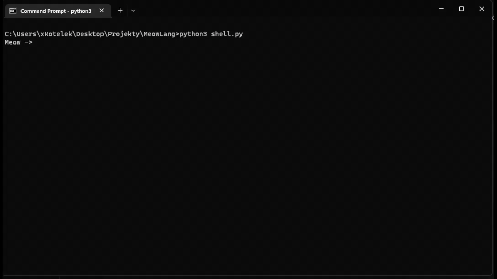

<div align="center">

# Meow

### **Programming language based on Python and custom BASIC implementation**
    


**[![CI Status][build-badge]][build-link] [![GitHub Releases][downloads-badge]][downloads-link] [![Discord][discord-badge]][discord-link] [![Website][website-badge]][website-link] [![Docs][docs-badge]][docs-link]**
    
[build-badge]: https://img.shields.io/github/actions/workflow/status/BetterDiscord/BetterDiscord/ci.yml?branch=main&logo=Github&logoColor=7C15BB&labelColor=0c0d10&color=7C15BB&style=for-the-badge
[build-link]: https://github.com/xKotelek/MeowLang/actions/workflows/ci.yml
    
[downloads-badge]: https://img.shields.io/github/downloads/xKotelek/MeowLang/total?labelColor=0c0d10&color=7C15BB&style=for-the-badge&logo=data:image/svg+xml;base64,PHN2ZyB3aWR0aD0iNDgiIGhlaWdodD0iNDgiIHZpZXdCb3g9IjAgMCA0OCA0OCIgZmlsbD0ibm9uZSIgeG1sbnM9Imh0dHA6Ly93d3cudzMub3JnLzIwMDAvc3ZnIj4KPHBhdGggZD0iTTEyLjI1IDM4LjVIMzUuNzVDMzYuNzE2NSAzOC41IDM3LjUgMzkuMjgzNSAzNy41IDQwLjI1QzM3LjUgNDEuMTY4MiAzNi43OTI5IDQxLjkyMTIgMzUuODkzNSA0MS45OTQyTDM1Ljc1IDQySDEyLjI1QzExLjI4MzUgNDIgMTAuNSA0MS4yMTY1IDEwLjUgNDAuMjVDMTAuNSAzOS4zMzE4IDExLjIwNzEgMzguNTc4OCAxMi4xMDY1IDM4LjUwNThMMTIuMjUgMzguNUgzNS43NUgxMi4yNVpNMjMuNjA2NSA2LjI1NThMMjMuNzUgNi4yNUMyNC42NjgyIDYuMjUgMjUuNDIxMiA2Ljk1NzExIDI1LjQ5NDIgNy44NTY0N0wyNS41IDhWMjkuMzMzTDMwLjI5MzEgMjQuNTQwN0MzMC45NzY1IDIzLjg1NzMgMzIuMDg0NiAyMy44NTczIDMyLjc2OCAyNC41NDA3QzMzLjQ1MTQgMjUuMjI0MiAzMy40NTE0IDI2LjMzMjIgMzIuNzY4IDI3LjAxNTZMMjQuOTg5OCAzNC43OTM4QzI0LjMwNjQgMzUuNDc3MiAyMy4xOTg0IDM1LjQ3NzIgMjIuNTE1IDM0Ljc5MzhMMTQuNzM2OCAyNy4wMTU2QzE0LjA1MzQgMjYuMzMyMiAxNC4wNTM0IDI1LjIyNDIgMTQuNzM2OCAyNC41NDA3QzE1LjQyMDIgMjMuODU3MyAxNi41MjgyIDIzLjg1NzMgMTcuMjExNyAyNC41NDA3TDIyIDI5LjMyOVY4QzIyIDcuMDgxODMgMjIuNzA3MSA2LjMyODgxIDIzLjYwNjUgNi4yNTU4TDIzLjc1IDYuMjVMMjMuNjA2NSA2LjI1NThaIiBmaWxsPSIjM2E3MWMxIi8+Cjwvc3ZnPgo=
[downloads-link]: https://github.com/xKotelek/MeowLang/releases/latest/download/Meow.exe
    
[discord-badge]: https://img.shields.io/badge/discord-green?labelColor=0c0d10&color=7C15BB&style=for-the-badge&logo=discord&logoColor=7C15BB
[discord-link]: https://discord.gg/Ctp22W28Aw

[website-badge]: https://img.shields.io/badge/website-green?labelColor=0c0d10&color=7C15BB&style=for-the-badge&logo=firefoxbrowser&logoColor=7C15BB
[website-link]: https://meow-lang.ml

[docs-badge]: https://img.shields.io/badge/docs-green?labelColor=0c0d10&color=7C15BB&style=for-the-badge&logo=readthedocs&logoColor=7C15BB
[docs-link]: https://github.com/xKotelek/MeowLang/wiki
    
### Introduction

**[Python](https://python.org)** is a programming language that can be used to create www's and do so more tasks like custom BASIC implementation or somethin like own programming language like Meow
<br>
**[BASIC](https://en.wikipedia.org/wiki/BASIC)** is a high-level programming language developed in 1964 by John George Kemeny and Thomas E. Kurtz at Dartmouth College based on Fortran and Algol-60.
</div>

### Installation

Visit [wiki page](https://github.com/xKotelek/MeowLang/wiki) to learn language and install it 

### Example

The example code is below!
```
# This is the example of meow language

FUN hello(text, separator, end)
    VAR txt = "Hello" + separator + text + end
    RETURN txt
END

PRINT(hello("World", " ", "!"))
```

This is an docs for this example:
```
PRINT(text or var)      -> prints text
FUN name(parameters)    -> function creator
END                     -> function closer
RETURN                  -> return function data
VAR                     -> create a variable
```

### Documentation

Visit [wiki page](https://github.com/xKotelek/MeowLang/wiki) for the documentation

### History

The first non-beta and non-public version of language has been made in 22 day of December in 2022 year.

### Showcase

First version of showcase is been available below ⬇️

